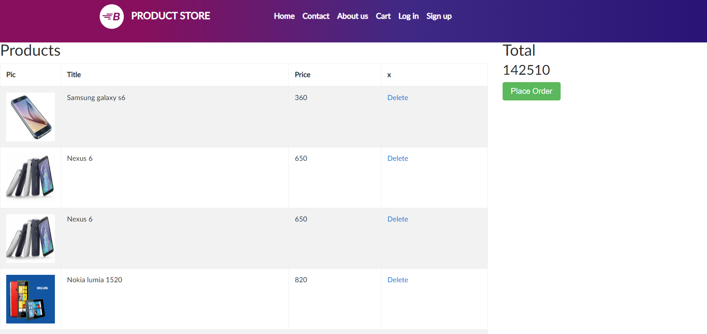

## BUGS HALL OF FAME

<ol>
    <li> <h3>Functional</h3>
        <ol>
            <li>
                Opening the cart webpage <a href="https://demoblaze.com/cart.html"> directly </a> results in populating cart items that weren't exist before.
                    
            </li>
            <li>
                In homepage, when you click on a "Next" at the bottom of the grid you get to the next page and if you click on product's image you won't be redirected into the product page.
                  
            </li>
            <li>
                In Cart, no matter if you have an item in the cart, you can click on "Place Order". It is a bug by itself when you have no items.
                Moreover you can fill wrong and invalid details at the billing page. For example there is no validity that the card number
                is a valid credit card number, or even if it is a number (possible to enter characters and it will be fine).
            </li>
        </ol>
    </li>
    <li> <h3>UI</h3>
        <ol>
            <li>
                placehodler
            </li>
        </ol>
    </li>

</ol>